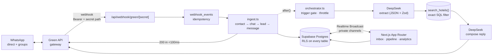

<div align="center">

# HollyCRM

**A WhatsApp-native CRM for Umrah &amp; Hajj hospitality — direct chats *and* groups — with an AI assistant that quotes from real inventory, never from imagination.**

[](https://nextjs.org)
[](https://react.dev)
[](https://typescriptlang.org)
[](https://supabase.com)
[](https://tailwindcss.com)
[](https://platform.deepseek.com)

</div>

---

## Contents

- [Why this exists](#why-this-exists)
- [Feature tour](#feature-tour)
- [Architecture](#architecture)
- [How the bot works](#how-the-bot-works)
- [Quick start](#quick-start)
- [Environment variables](#environment-variables)
- [Deploying to Vercel](#deploying-to-vercel)
- [Project structure](#project-structure)
- [Security model](#security-model)
- [In-app configuration](#in-app-configuration)
- [Testing without WhatsApp](#testing-without-whatsapp)
- [Known risks](#known-risks)
- [Not built](#not-built)
- [Maintaining this README](#maintaining-this-readme)

---

## Why this exists

Umrah and Hajj packages are sold in WhatsApp groups, not in email threads. A family of eight negotiates in one group; three separate leads live inside it; the agent who answers first wins the booking. Generic CRMs model none of that.

HollyCRM treats the **conversation** as the first-class entity — a group chat can hold many leads, and message history survives lead deletion — then layers a shared inbox, a pipeline, and an AI assistant on top of it.

Built to the corrected spec in **[HollyCRM_PRD_v2.md](HollyCRM_PRD_v2.md)**. The defects in v1.1 that forced the rewrite are catalogued in **[ARCHITECTURE_REVIEW.md](ARCHITECTURE_REVIEW.md)** — 14 schema defects, 9 security holes, and an AI stack written for a provider the project doesn't have.

---

## Feature tour

| Module | What ships today |
|---|---|
| **WhatsApp integration** | Verified + deduplicated inbound webhook, outbound text / files / voice notes, delivery receipts, live instance-state banner, inbound media mirrored to private storage |
| **Shared inbox** | Filters and search, claim / assign / release, bot pause with auto-resume, internal notes with `@mention`, archive, unread counts, Realtime thread updates |
| **Pipeline** | Enum-typed stages, auto-advance driven by the bot, manual moves, mandatory drop reason on Closed-Lost, full stage history |
| **AI assistant** | DeepSeek extraction → `search_hotels()` → composition, conversation memory, group trigger + throttle, human handoff, `ai_runs` telemetry |
| **Analytics** | Funnel conversion, first response time, automation rate, group-vs-direct ROI, AI latency and failure rate |
| **Team &amp; workspaces** | One workspace per signup, email invitations, `owner` / `sales_agent` roles, deactivation instead of deletion, profile avatars |
| **Settings studio** | WhatsApp connections, AI agent personality and guardrails, hotel inventory — all editable in-app, no redeploy |

---

## Architecture



**Stack:** Next.js 15 (App Router, RSC) · Supabase (Postgres 15, Auth, RLS, Realtime Broadcast, Storage) · Green API · DeepSeek `deepseek-chat` · Tailwind CSS 3.4

---

## How the bot works

```
extract (DeepSeek, JSON mode + Zod)  →  search_hotels() SQL  →  compose (DeepSeek)
```

The model never sees the inventory table and cannot query it. It only receives the rows `search_hotels()` returned.

> **Every price, distance, and availability figure in a reply comes from SQL, not from the model.**

That inversion is the core design decision. Similarity search cannot enforce a price ceiling or a date range — it returns *close* matches, so a pure-RAG bot confidently quotes hotels that are too expensive, too far, or fully booked. The v1.1 embedding pipeline was replaced for exactly this reason ([ARCHITECTURE_REVIEW.md §A3](ARCHITECTURE_REVIEW.md)).

**Reliability path**, in order: JSON output mode → Zod validation → one repair retry → deterministic regex/keyword fallback. A 20-second hard timeout ends in a canned holding message plus auto-assignment to a human, and every invocation is logged to `ai_runs` with latency, tokens, and outcome.

**Group behaviour** is passive by default. The bot replies only when the instance's own JID appears in `mentionedJidList` or a configured intent keyword matches — subject to a per-group cooldown (default 60s) and a daily cap (default 10). Both limits are read and enforced inside `bot_gate()` in SQL, so they hold atomically under concurrent webhooks.

---

## Quick start

**Prerequisites:** Node 20+, a Supabase project, a DeepSeek API key, and a Green API instance.

### 1 · Install

```bash
npm install
cp .env.example .env.local
```

### 2 · Database

Run every migration in `supabase/migrations/` **in filename order**, via the Supabase SQL Editor or `supabase db push`:

```
0001_hollycrm_init.sql          →  0010_workspace_roles.sql
0002_demo_seed.sql              →  0011_workspaces_and_invitations.sql
0003_storage_and_ops.sql        →  0012_team_management.sql
0004_atomic_state.sql           →  0013_generic_assistant_default.sql
0005_auth_onboarding.sql        →  0014_profile_avatars.sql
0005_security_hardening.sql     →  0015_lock_privileged_columns.sql
0006_close_and_delete.sql       →  0016_bot_conversation_memory.sql
0007_settings_studio.sql        →  0017_derive_rooms_from_party.sql
0008_conversation_cleanup.sql
0009_media_filenames.sql
```

The order matters — several migrations depend on enum values or functions added by an earlier one. `0002_demo_seed.sql` prints an org id; copy it into `DEMO_ORG_ID` if you want the seeded demo inventory.

> `0002_demo_seed.sql` contains **fictional** hotels, prices, and distances written to exercise `search_hotels()`. Replace it with real inventory before showing anything to a customer.

### 3 · Run

```bash
npm run dev
```

Sign up at `/signup`. A database trigger creates your workspace, profile, and `owner` role automatically — no manual `profiles` insert. Visit `/setup` at any time for a live checklist of which environment variables are still missing.

### 4 · Point Green API at the webhook

```
https://<public-host>/api/webhook/green/<GREEN_API_WEBHOOK_SECRET>
```

Set `webhookUrlToken` in the Green API console to the same value as `GREEN_API_WEBHOOK_TOKEN`. Requests without a matching `Authorization: Bearer` header are rejected with 401 before the payload is parsed.

For local development, tunnel with `ngrok http 3000` or `cloudflared tunnel` — Green API needs a publicly reachable HTTPS URL.

### Scripts

| Command | Does |
|---|---|
| `npm run dev` | Dev server on `:3000` |
| `npm run build` | Production build |
| `npm start` | Serve the production build |
| `npm run lint` | ESLint via `next lint` |
| `npm run typecheck` | `tsc --noEmit` |

> `next.config.ts` reads `distDir` from `NEXT_DIST_DIR`. Set it (e.g. `NEXT_DIST_DIR=.next-build`) when running a build while `next dev` is serving — both default to `.next`, and sharing that directory corrupts whichever finishes second.

---

## Environment variables

Copy from [`.env.example`](.env.example). Nothing here belongs in git — `.env*` is ignored except the example.

<details>
<summary><b>Supabase</b> — required for the app to start at all</summary>

| Variable | Where to find it |
|---|---|
| `NEXT_PUBLIC_SUPABASE_URL` | Project Settings → API → Project URL |
| `NEXT_PUBLIC_SUPABASE_ANON_KEY` | Same page → `anon` / public key |
| `SUPABASE_SERVICE_ROLE_KEY` | Same page → `service_role` key. **Bypasses RLS. Server routes only — never expose to the browser.** |

</details>

<details>
<summary><b>Green API</b> — required to send and receive WhatsApp messages</summary>

| Variable | Where to find it |
|---|---|
| `GREEN_API_BASE_URL` | Console → `apiUrl`, e.g. `https://7107.api.greenapi.com` (per-instance host) |
| `GREEN_API_ID_INSTANCE` | Console → `idInstance` |
| `GREEN_API_TOKEN` | Console → API token |
| `GREEN_API_WEBHOOK_SECRET` | Any random string. Forms the unguessable webhook URL path. |
| `GREEN_API_WEBHOOK_TOKEN` | Must match `webhookUrlToken` in the Green API console. |
| `GREEN_API_OWN_JID` | The instance's own JID, e.g. `9665XXXXXXXX@c.us` — used to detect `@mentions` in groups |

These are a **fallback for local development**. In production the active instance's credentials live in `green_api_instances` and are managed from `/settings/whatsapp`.

</details>

<details>
<summary><b>DeepSeek</b> — required for the AI bot, not for browsing the inbox</summary>

| Variable | Notes |
|---|---|
| `DEEPSEEK_API_KEY` | platform.deepseek.com → API keys |
| `DEEPSEEK_BASE_URL` | `https://api.deepseek.com` |
| `DEEPSEEK_MODEL` | `deepseek-chat` only. `deepseek-reasoner` emits a reasoning trace and blows the latency budget. |

</details>

<details>
<summary><b>Demo</b></summary>

| Variable | Notes |
|---|---|
| `DEMO_ORG_ID` | The org id printed by `0002_demo_seed.sql` |

</details>

---

## Deploying to Vercel

1. **Import the repo.** Vercel auto-detects Next.js; leave the build and output settings on their defaults.
2. **Add every variable** from the tables above under Settings → Environment Variables, for Production *and* Preview. Mark `SUPABASE_SERVICE_ROLE_KEY`, `GREEN_API_TOKEN`, and `DEEPSEEK_API_KEY` as sensitive.
3. **Do not set `NEXT_DIST_DIR`** on Vercel. It exists for local concurrent builds; overriding the output directory will break the deployment.
4. **Run the migrations** against the production Supabase project before the first deploy — the app renders an empty inbox, not an error, when RLS finds no schema.
5. **Repoint the Green API webhook** at the deployed origin:
   ```
   https://<your-app>.vercel.app/api/webhook/green/<GREEN_API_WEBHOOK_SECRET>
   ```
   The middleware matcher deliberately excludes `api/webhook`, so the webhook is never redirected to a login page.
6. **Add the deployment origin** to Supabase → Authentication → URL Configuration (Site URL and Redirect URLs), or the email confirmation and invitation links will bounce to `localhost`.

**Preview deployments get a new URL per commit.** Green API points at exactly one webhook, so previews receive no WhatsApp traffic — use `/api/dev/simulate` there instead.

---

## Project structure

```
src/
├── app/
│   ├── api/
│   │   ├── webhook/green/[secret]/   Inbound: verify → dedupe → persist → 200 fast, bot in after()
│   │   ├── chats/[chatId]/           send · voice · media · documents · notes · assign · bot · archive · close
│   │   ├── settings/                 instances · bot · hotels · team · cleanup
│   │   ├── dev/simulate/             Runs the bot brain with no WhatsApp attached
│   │   └── invite/ · profile/ · leads/ · instance/
│   ├── inbox/                        Shared inbox + Realtime thread
│   ├── pipeline/                     Stage board
│   ├── analytics/                    Funnel · FRT · automation rate · group ROI
│   ├── settings/                     whatsapp · ai · inventory · team · data
│   ├── login/ · signup/ · invite/    Auth and onboarding
│   └── setup/                        Live environment-variable checklist
├── components/
│   ├── RightPanel.tsx                Lead · Notes · Files · Quotes · People tabs
│   ├── media/                        Image · audio · file bubbles, voice recorder
│   └── ui/                           Avatar · Chip · Dropdown · Icon · Skeleton · ConfirmDialog
├── lib/
│   ├── bot/                          ingest · orchestrator · settings
│   ├── deepseek/                     client · extract · compose (+ ai_runs telemetry)
│   ├── green/                        API wrapper with serialized sends
│   ├── supabase/                     client (browser) · server (RSC) · admin (service role)
│   └── audio/ · media.ts · env.ts · types.ts
└── middleware.ts                     Refreshes the Supabase auth cookie
supabase/migrations/                  0001 → 0017, run in order
```

---

## Security model

Enforcement lives in Postgres, not in the API layer — the anon key ships in the browser bundle, and PostgREST is a public endpoint. "The UI does not offer it" is not a security control.

| Control | Implementation |
|---|---|
| **Tenant isolation** | `org_id` on every business table; every RLS policy keyed on `app.current_org_id()`. One workspace per signup ([0011](supabase/migrations/0011_workspaces_and_invitations.sql)). |
| **RLS coverage** | Enabled with explicit policies on every table in `public` — no exceptions, and never a `USING` clause without a matching `WITH CHECK`. |
| **Privilege escalation** | Column-level lock so a member cannot `PATCH role='owner'` at the REST API ([0015](supabase/migrations/0015_lock_privileged_columns.sql)). Verified against a live sales-agent token. |
| **Identity documents** | Private Storage bucket. Green API receives a short-lived signed URL, never a public object URL. Passport scans are Saudi PDPL and GDPR data. |
| **Webhook authenticity** | Unguessable path segment **plus** `Authorization: Bearer` verification, both checked before the body is parsed. |
| **Realtime** | Private Broadcast channels with an RLS policy on `realtime.messages` authorizing the topic against chat access — Broadcast is *not* RLS-protected by default. |
| **Function exposure** | `EXECUTE` revoked from `PUBLIC` on `SECURITY DEFINER` functions; `search_path` pinned ([0005_security_hardening](supabase/migrations/0005_security_hardening.sql)). |
| **Destructive actions** | Chat deletion is supervisor-only at the RLS layer, so the API route cannot be talked into it. Bulk cleanup is scoped and previewed — won deals and quoted leads are structurally excluded. |

---

## In-app configuration

Runtime config lives in the database, not `.env` — editable from the UI, applied within ~30 seconds, no restart or redeploy.

| Page | Controls | Stored in |
|---|---|---|
| `/settings` | Numbered setup hub with live completion state | — |
| `/settings/whatsapp` | Connect Green API instances; radio-select the sending number. Credentials validated live, webhook configured on Green API automatically. | `green_api_instances` |
| `/settings/ai` | Agent name, master on/off, greeting (EN/AR), group trigger keywords, cooldown + daily cap, handoff keywords, style instructions | `bot_settings` |
| `/settings/inventory` | Hotels, room types, seasonal rates with allotment | `hotels` · `hotel_room_types` · `hotel_rates` |
| `/settings/team` | Invite agents, change roles, deactivate members | `profiles` · `invitations` |
| `/settings/data` | Scoped conversation cleanup with preview | — |

Writes are owner-only, enforced by RLS. Style instructions can shape tone but **never** override the inventory-only pricing rule.

---

## Testing without WhatsApp

The bot brain runs independently of Green API — useful in development, on preview deployments, and as a demo fallback:

```bash
curl -X POST localhost:3000/api/dev/simulate \
  -H "Content-Type: application/json" \
  -d '{"text":"5 star Makkah hotel under 1300 riyal near Haram, 10-15 September 2026, 8 people"}'
```

Returns the extracted requirements, the matching inventory rows, the composed reply, and per-stage timings.

---

## Known risks

**Green API is an unofficial gateway.** It drives WhatsApp Web, which is against WhatsApp's ToS for automated commercial use, and the number can be banned — taking the client's live customer groups with it. This is the largest business risk in the design.

Mitigations in place and recommended practice:

- Dedicated SIM, never the owner's personal number
- Warm-up period before automated volume
- Human-like pacing — sends are serialized per instance with a delay
- No unsolicited outbound, no bulk blasts
- Per-group reply caps and a global kill switch
- Documented migration path to WABA for 1-on-1, with groups staying on Green API

Watch `stateInstanceChanged`. `notAuthorized`, `blocked`, and `sleepMode` mean the WhatsApp session is dead; the CRM shows a banner rather than failing silently.

---

## Not built

- **Passport / voucher OCR** and **inbound voice-note transcription.** DeepSeek has no vision or audio model, so this needs a separate provider. Media is stored and flagged for agent review, not parsed. *(Recording and sending outbound voice notes does work.)*
- **Live Hollyland inventory sync** and the **embeddings pipeline.** `search_hotels()` runs on exact SQL and does not need embeddings to work; pgvector is included in the schema as an optional re-ranker for descriptive nuance ("quiet", "near Clock Tower"), never as the filter.

---

## Maintaining this README

Keep it honest — the value of this file is that it describes what actually ships.

| When you… | Update |
|---|---|
| Add a migration | The list in [Quick start §2](#2--database) and, if it changes enforcement, [Security model](#security-model) |
| Add or rename an env var | [`.env.example`](.env.example), `src/lib/env.ts`, and the [Environment variables](#environment-variables) tables |
| Add a route or top-level directory | [Project structure](#project-structure) |
| Ship a module | [Feature tour](#feature-tour), and remove it from [Not built](#not-built) |
| Change the bot pipeline | [How the bot works](#how-the-bot-works) and the [Architecture](#architecture) diagram |

**Reference docs:** [HollyCRM_PRD_v2.md](HollyCRM_PRD_v2.md) (current spec) · [ARCHITECTURE_REVIEW.md](ARCHITECTURE_REVIEW.md) (why v1.1 was rewritten) · [DEMO_RUNBOOK.md](DEMO_RUNBOOK.md) (demo scope and contingencies) · [UI_PROMPT.md](UI_PROMPT.md) (design language) · [HollyCRM_Supabase_PRD.md](HollyCRM_Supabase_PRD.md) (v1.1, historical — do not build from it)
